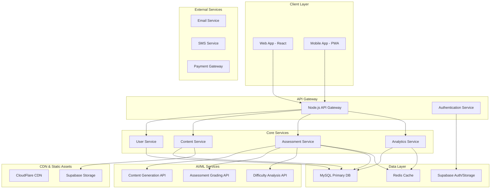
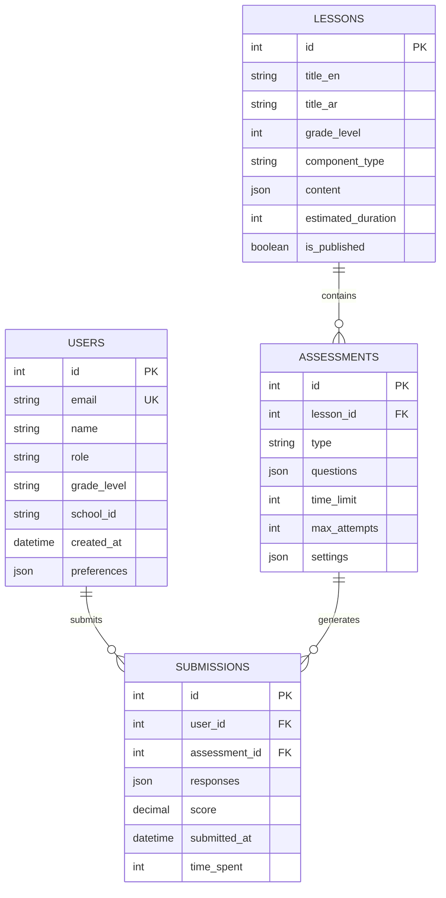
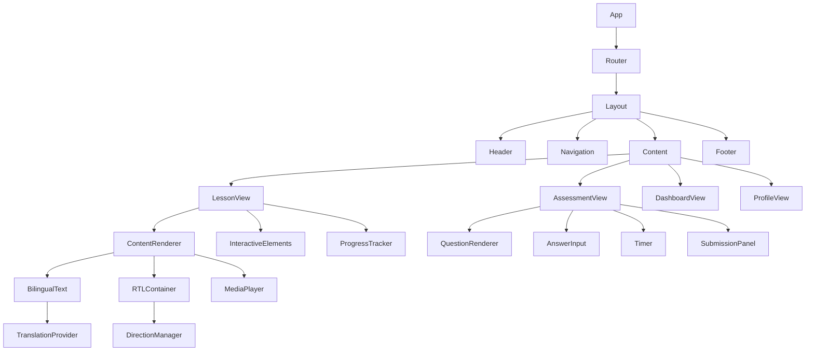

# Kuwait English Learning Platform (KPL) - Comprehensive Application Architecture

## Executive Summary

The Kuwait English Learning Platform (KPL) is a bilingual Arabic/English educational technology platform designed specifically for Kuwait's Ministry of Education English examination system (Grades 10-12). Based on extensive research into Kuwait's assessment structure and modern EdTech best practices, this architecture document provides a comprehensive blueprint for building a scalable, accessible, and educationally effective learning platform.

The platform addresses the unique requirements of Kuwait's English curriculum, which includes eight core examination components: Vocabulary, Grammar, Language Functions, Set Book Questions, Expository Writing, Reading Comprehension, Summary Making, and Translation. The system follows the cumulative assessment model (10% Grade 10, 20% Grade 11, 70% Grade 12) and implements both school-level and national-level scoring protocols.

## Table of Contents

1. [Technology Stack Recommendations](#technology-stack-recommendations)
2. [System Architecture](#system-architecture)
3. [API Endpoint Design](#api-endpoint-design)
4. [Component Hierarchy for Bilingual UI](#component-hierarchy-for-bilingual-ui)
5. [Database Integration Strategy](#database-integration-strategy)
6. [State Management Approach](#state-management-approach)
7. [Performance Optimization Strategies](#performance-optimization-strategies)
8. [Security Considerations](#security-considerations)
9. [Implementation Roadmap](#implementation-roadmap)
10. [Risk Mitigation and Quality Assurance](#risk-mitigation-and-quality-assurance)

## 1. Technology Stack Recommendations

### 1.1 Frontend Technology Selection: React vs Vue vs Svelte

**Recommended: React with TypeScript**

**Rationale:**
- **Ecosystem Maturity**: React's extensive ecosystem provides mature solutions for bilingual/RTL interfaces, animation libraries (Motion/Framer Motion), and accessibility tools
- **Educational Platform Fit**: Strong integration with learning analytics, interactive content delivery, and complex state management
- **Component Architecture**: Excellent support for reusable, accessible components following Material Design guidelines
- **Performance**: Concurrent features in React 18+ support educational use cases requiring smooth interactions
- **Developer Expertise**: Widespread developer familiarity reduces implementation risk

**Alternative Evaluation:**
- **Vue 3**: Strong choice for rapid development, but ecosystem gaps in educational-specific tools
- **Svelte**: Performance advantages, but limited ecosystem for complex EdTech requirements

### 1.2 Backend Technology Selection: Node.js vs Python

**Recommended: Node.js with TypeScript + Python Microservices**

**Hybrid Architecture Rationale:**
- **Node.js Primary**: Handle real-time features, API gateway, authentication, and user management
- **Python Microservices**: AI/ML services for automated assessment, content generation, and learning analytics
- **Best of Both Worlds**: Node.js for I/O-intensive operations, Python for computational tasks

**Technology Stack:**
```
Frontend: React 18 + TypeScript + Tailwind CSS + Framer Motion
Backend API: Node.js + Express.js + TypeScript
AI/ML Services: Python + FastAPI + scikit-learn + transformers
Database: MySQL (primary) + Supabase (secondary/auth/realtime)
Cache: Redis
Message Queue: Redis/Bull for job processing
Storage: Supabase Storage for media files
Monitoring: Sentry + Custom analytics
```

### 1.3 Supporting Technology Stack

**Animation & Interactive Content:**
- Framer Motion for educational animations
- Lottie for micro-interactions
- Three.js for 3D educational content (optional)

**AI/ML Stack:**
- Python FastAPI for ML service endpoints
- transformers library (Hugging Face) for NLP tasks
- OpenAI API or local LLM for content generation
- Custom assessment algorithms for difficulty calibration

**Testing & Quality:**
- Jest + React Testing Library for frontend
- Playwright for E2E testing
- Vitest for performance testing
- ESLint + Prettier + TypeScript for code quality

## 2. System Architecture

### 2.1 High-Level Architecture



### 2.2 Microservices Architecture

**Core Services:**

1. **User Service**
   - Authentication & authorization
   - Profile management
   - Role-based access (Student/Teacher/Admin)
   - Progress tracking

2. **Content Service**
   - Lesson management
   - Multimedia content delivery
   - Bilingual content handling
   - Version control

3. **Assessment Service**
   - Exam creation and delivery
   - Question bank management
   - Automated grading
   - Score reporting

4. **Analytics Service**
   - Learning analytics
   - Performance dashboards
   - Early warning systems
   - Custom reporting

5. **AI Services**
   - Content generation
   - Assessment creation
   - Difficulty calibration
   - Personalized recommendations

### 2.3 Data Architecture



## 3. API Endpoint Design

### 3.1 RESTful API Structure

**Base URL:** `https://api.kpl.edu.kw/v1`

**Authentication:** JWT tokens via Supabase Auth

### 3.2 Core API Endpoints

#### User Management
```typescript
// Authentication
POST   /auth/login
POST   /auth/logout
POST   /auth/refresh
GET    /auth/profile
PUT    /auth/profile

// User Management
GET    /users/students              // Teachers/Admins only
GET    /users/:id
PUT    /users/:id
DELETE /users/:id                   // Admin only

// User Preferences
GET    /users/:id/preferences
PUT    /users/:id/preferences
```

#### Content Management
```typescript
// Lessons
GET    /lessons                     // List with filtering
GET    /lessons/:id
POST   /lessons                     // Teachers/Admins
PUT    /lessons/:id                 // Teachers/Admins
DELETE /lessons/:id                 // Admin only

// Content Structure
GET    /lessons/:id/content
PUT    /lessons/:id/content         // Structured content updates

// Bilingual Content
GET    /lessons/:id/translation/:lang
POST   /lessons/:id/translation
PUT    /lessons/:id/translation/:lang
```

#### Assessment System
```typescript
// Assessments
GET    /assessments                 // List with filtering
GET    /assessments/:id
POST   /assessments                 // Create new assessment
PUT    /assessments/:id             // Update assessment
DELETE /assessments/:id             // Admin only

// Exam Delivery
POST   /assessments/:id/start       // Start exam session
GET    /assessments/:id/questions   // Get exam questions
POST   /assessments/:id/submit      // Submit responses
GET    /assessments/:id/results     // Get results

// Kuwait Exam Components
GET    /assessments/components/vocabulary
GET    /assessments/components/grammar
GET    /assessments/components/language-functions
GET    /assessments/components/reading-comprehension
GET    /assessments/components/writing
GET    /assessments/components/translation
```

#### Learning Analytics
```typescript
// Student Progress
GET    /analytics/student/:id/progress
GET    /analytics/student/:id/performance
GET    /analytics/student/:id/weaknesses
GET    /analytics/student/:id/recommendations

// Class Analytics
GET    /analytics/class/:id/overview
GET    /analytics/class/:id/performance
GET    /analytics/class/:id/engagement

// Early Warning System
GET    /analytics/early-warning/students
POST   /analytics/early-warning/rules
PUT    /analytics/early-warning/:id
```

#### AI Services
```typescript
// Content Generation
POST   /ai/generate/questions
POST   /ai/generate/lesson-content
POST   /ai/generate/distractors
GET    /ai/calibrate/difficulty/:assessment_id

// Assessment Assistance
POST   /ai/grade/essay
POST   /ai/analyze/reading-comprehension
POST   /ai/suggest/improvements
```

### 3.3 WebSocket Endpoints

```typescript
// Real-time Features
WS     /ws/exam-session/:id         // Live exam monitoring
WS     /ws/progress/:user_id        // Real-time progress updates
WS     /ws/collaboration/:lesson_id // Collaborative learning features
```

### 3.4 API Response Standards

**Success Response:**
```typescript
{
  "success": true,
  "data": {},
  "meta": {
    "timestamp": "2025-11-08T12:46:34Z",
    "request_id": "req_123456"
  }
}
```

**Error Response:**
```typescript
{
  "success": false,
  "error": {
    "code": "VALIDATION_ERROR",
    "message": "Invalid input data",
    "details": {
      "field": "email",
      "reason": "Invalid email format"
    }
  },
  "meta": {
    "timestamp": "2025-11-08T12:46:34Z",
    "request_id": "req_123456"
  }
}
```

## 4. Component Hierarchy for Bilingual UI

### 4.1 Component Architecture



### 4.2 Core Component Library

#### Layout Components
```typescript
// Layout.tsx
interface LayoutProps {
  children: React.ReactNode;
  userRole: 'student' | 'teacher' | 'admin';
  currentLesson?: Lesson;
}

const Layout: React.FC<LayoutProps> = ({ children, userRole, currentLesson }) => {
  return (
    <DirectionProvider>
      <div className={`app-layout ${getLayoutClass(userRole)}`}>
        <Header userRole={userRole} />
        <Navigation currentLesson={currentLesson} />
        <main className="content-area">
          <ProgressTracker lesson={currentLesson} />
          {children}
        </main>
        <Footer />
      </div>
    </DirectionProvider>
  );
};
```

#### Bilingual Text Components
```typescript
// BilingualText.tsx
interface BilingualTextProps {
  english: string;
  arabic: string;
  className?: string;
  showTranslation?: boolean;
  translationMode?: 'toggle' | 'parallel' | 'tooltip';
}

const BilingualText: React.FC<BilingualTextProps> = ({
  english,
  arabic,
  className,
  showTranslation = false,
  translationMode = 'toggle'
}) => {
  const { language } = useLanguage();
  const { direction } = useDirection();
  
  return (
    <div className={`bilingual-text ${className} ${direction}`}>
      {language === 'en' && (
        <span className="text-english" dir="ltr">
          {english}
        </span>
      )}
      {language === 'ar' && (
        <span className="text-arabic" dir="rtl">
          {arabic}
        </span>
      )}
      {showTranslation && (
        <TranslationToggle 
          mode={translationMode}
          english={english}
          arabic={arabic}
        />
      )}
    </div>
  );
};
```

#### Assessment Components
```typescript
// QuestionRenderer.tsx
interface QuestionProps {
  question: KuwaitExamQuestion;
  questionNumber: number;
  onAnswer: (answer: Answer) => void;
  showFeedback?: boolean;
  isReadOnly?: boolean;
}

const QuestionRenderer: React.FC<QuestionProps> = ({
  question,
  questionNumber,
  onAnswer,
  showFeedback = false,
  isReadOnly = false
}) => {
  const renderQuestionByType = () => {
    switch (question.type) {
      case 'vocabulary_mcq':
        return <VocabularyMCQ question={question} onAnswer={onAnswer} />;
      case 'grammar_mcq':
        return <GrammarMCQ question={question} onAnswer={onAnswer} />;
      case 'language_function':
        return <LanguageFunctionQuestion question={question} onAnswer={onAnswer} />;
      case 'reading_comprehension':
        return <ReadingComprehension question={question} onAnswer={onAnswer} />;
      case 'writing':
        return <WritingQuestion question={question} onAnswer={onAnswer} />;
      case 'translation':
        return <TranslationQuestion question={question} onAnswer={onAnswer} />;
      default:
        return <div>Unsupported question type</div>;
    }
  };

  return (
    <div className="question-container" data-question-type={question.type}>
      <QuestionHeader 
        number={questionNumber}
        type={question.component}
        points={question.points}
      />
      <BilingualText
        english={question.prompt_en}
        arabic={question.prompt_ar}
        className="question-prompt"
      />
      {renderQuestionByType()}
    </div>
  );
};
```

#### RTL-Aware Components
```typescript
// RTLContainer.tsx
interface RTLContainerProps {
  children: React.ReactNode;
  className?: string;
  mirror?: boolean;
}

const RTLContainer: React.FC<RTLContainerProps> = ({
  children,
  className = '',
  mirror = true
}) => {
  const { direction } = useDirection();
  
  return (
    <div 
      className={`
        rtl-container 
        ${direction} 
        ${mirror ? 'mirror-enabled' : 'mirror-disabled'}
        ${className}
      `}
      dir={direction}
    >
      {children}
    </div>
  );
};

// Usage example
const KuwaitExamInterface = () => {
  return (
    <RTLContainer className="exam-interface">
      <div className="exam-header">
        <BilingualText 
          english="Kuwait English Exam"
          arabic="امتحان اللغة الإنجليزية للكويت"
        />
        <Timer duration={180} /> // 3 hours for Grade 12
      </div>
      
      <RTLContainer className="question-section" mirror={true}>
        <NavigationControls />
        <QuestionRenderer />
        <SubmissionPanel />
      </RTLContainer>
    </RTLContainer>
  );
};
```

### 4.3 State Management Integration

```typescript
// Global State Structure
interface AppState {
  user: UserState;
  content: ContentState;
  assessment: AssessmentState;
  ui: UIState;
  analytics: AnalyticsState;
}

interface AssessmentState {
  currentExam: Exam | null;
  currentQuestion: number;
  answers: Record<string, Answer>;
  timeRemaining: number;
  isSubmitting: boolean;
  autoSaveEnabled: boolean;
}

// Assessment Context Provider
const AssessmentProvider: React.FC<{ children: React.ReactNode }> = ({ children }) => {
  const [state, dispatch] = useReducer(assessmentReducer, initialState);
  
  const actions = {
    startExam: (examId: string) => dispatch({ type: 'START_EXAM', payload: examId }),
    answerQuestion: (questionId: string, answer: Answer) => 
      dispatch({ type: 'ANSWER_QUESTION', payload: { questionId, answer } }),
    submitExam: () => dispatch({ type: 'SUBMIT_EXAM' }),
    autoSave: () => dispatch({ type: 'AUTO_SAVE' })
  };
  
  return (
    <AssessmentContext.Provider value={{ state, actions }}>
      {children}
    </AssessmentContext.Provider>
  );
};
```

## 5. Database Integration Strategy

### 5.1 Dual Database Architecture

**Primary Database: MySQL**
- User management and authentication
- Academic content and curriculum data
- Assessment and examination data
- Learning analytics and progress tracking

**Secondary Database: Supabase**
- Real-time features
- File storage and media assets
- Additional authentication providers
- Edge functions for serverless operations

### 5.2 Database Schema Design

#### Core Tables
```sql
-- Users and Authentication
CREATE TABLE users (
    id INT PRIMARY KEY AUTO_INCREMENT,
    email VARCHAR(255) UNIQUE NOT NULL,
    name_en VARCHAR(255) NOT NULL,
    name_ar VARCHAR(255),
    role ENUM('student', 'teacher', 'admin') NOT NULL,
    grade_level ENUM('10', '11', '12'),
    school_id INT,
    student_id VARCHAR(50),
    created_at TIMESTAMP DEFAULT CURRENT_TIMESTAMP,
    updated_at TIMESTAMP DEFAULT CURRENT_TIMESTAMP ON UPDATE CURRENT_TIMESTAMP,
    preferences JSON,
    INDEX idx_email (email),
    INDEX idx_role_grade (role, grade_level),
    INDEX idx_school (school_id)
);

-- Kuwait Exam Components Configuration
CREATE TABLE exam_components (
    id INT PRIMARY KEY AUTO_INCREMENT,
    name ENUM('vocabulary', 'grammar', 'language_functions', 'set_book', 'expository_writing', 'reading_comprehension', 'summary_making', 'translation') NOT NULL,
    name_en VARCHAR(255) NOT NULL,
    name_ar VARCHAR(255) NOT NULL,
    description_en TEXT,
    description_ar TEXT,
    weight_grade10 DECIMAL(3,2),
    weight_grade11 DECIMAL(3,2),
    weight_grade12 DECIMAL(3,2),
    created_at TIMESTAMP DEFAULT CURRENT_TIMESTAMP,
    UNIQUE KEY uk_component_grade (name, grade_level)
);

-- Lessons and Content
CREATE TABLE lessons (
    id INT PRIMARY KEY AUTO_INCREMENT,
    title_en VARCHAR(255) NOT NULL,
    title_ar VARCHAR(255) NOT NULL,
    component_id INT NOT NULL,
    grade_level ENUM('10', '11', '12') NOT NULL,
    unit_number INT,
    lesson_number INT,
    content_en JSON,
    content_ar JSON,
    media_assets JSON,
    estimated_duration INT, -- minutes
    difficulty_level ENUM('beginner', 'intermediate', 'advanced'),
    learning_objectives JSON,
    prerequisites JSON,
    is_published BOOLEAN DEFAULT FALSE,
    version INT DEFAULT 1,
    created_by INT,
    created_at TIMESTAMP DEFAULT CURRENT_TIMESTAMP,
    updated_at TIMESTAMP DEFAULT CURRENT_TIMESTAMP ON UPDATE CURRENT_TIMESTAMP,
    FOREIGN KEY (component_id) REFERENCES exam_components(id),
    FOREIGN KEY (created_by) REFERENCES users(id),
    INDEX idx_component_grade (component_id, grade_level),
    INDEX idx_published (is_published),
    INDEX idx_search (title_en, title_ar)
);

-- Question Bank
CREATE TABLE questions (
    id INT PRIMARY KEY AUTO_INCREMENT,
    component_id INT NOT NULL,
    grade_level ENUM('10', '11', '12') NOT NULL,
    type ENUM('mcq', 'true_false', 'short_answer', 'essay', 'translation', 'reading_comprehension') NOT NULL,
    question_text_en TEXT NOT NULL,
    question_text_ar TEXT NOT NULL,
    options JSON, -- for MCQ questions
    correct_answer JSON NOT NULL,
    explanation_en TEXT,
    explanation_ar TEXT,
    difficulty_score DECIMAL(3,2), -- 0.0 to 1.0
    bloom_level ENUM('remember', 'understand', 'apply', 'analyze', 'evaluate', 'create'),
    tags JSON,
    source_reference VARCHAR(255),
    usage_count INT DEFAULT 0,
    created_by INT,
    created_at TIMESTAMP DEFAULT CURRENT_TIMESTAMP,
    updated_at TIMESTAMP DEFAULT CURRENT_TIMESTAMP ON UPDATE CURRENT_TIMESTAMP,
    FOREIGN KEY (component_id) REFERENCES exam_components(id),
    FOREIGN KEY (created_by) REFERENCES users(id),
    INDEX idx_component_grade_type (component_id, grade_level, type),
    INDEX idx_difficulty (difficulty_score),
    INDEX idx_tags (tags)
);

-- Assessments/Exams
CREATE TABLE assessments (
    id INT PRIMARY KEY AUTO_INCREMENT,
    title_en VARCHAR(255) NOT NULL,
    title_ar VARCHAR(255) NOT NULL,
    type ENUM('practice', 'unit_test', 'midterm', 'final', 'mock_exam') NOT NULL,
    grade_level ENUM('10', '11', '12') NOT NULL,
    component_ids JSON, -- array of component IDs included
    questions JSON NOT NULL, -- array of question IDs with configuration
    time_limit INT, -- minutes
    max_attempts INT DEFAULT 1,
    passing_score DECIMAL(5,2),
    randomize_questions BOOLEAN DEFAULT TRUE,
    randomize_options BOOLEAN DEFAULT TRUE,
    show_results_immediately BOOLEAN DEFAULT FALSE,
    allow_review BOOLEAN DEFAULT TRUE,
    settings JSON,
    is_published BOOLEAN DEFAULT FALSE,
    created_by INT,
    created_at TIMESTAMP DEFAULT CURRENT_TIMESTAMP,
    updated_at TIMESTAMP DEFAULT CURRENT_TIMESTAMP ON UPDATE CURRENT_TIMESTAMP,
    FOREIGN KEY (created_by) REFERENCES users(id),
    INDEX idx_type_grade (type, grade_level),
    INDEX idx_published (is_published)
);

-- Student Submissions
CREATE TABLE submissions (
    id INT PRIMARY KEY AUTO_INCREMENT,
    user_id INT NOT NULL,
    assessment_id INT NOT NULL,
    responses JSON NOT NULL,
    score DECIMAL(5,2),
    max_score DECIMAL(5,2),
    percentage_score DECIMAL(5,2),
    time_spent INT, -- seconds
    started_at TIMESTAMP,
    submitted_at TIMESTAMP,
    attempt_number INT DEFAULT 1,
    status ENUM('in_progress', 'submitted', 'graded', 'expired') DEFAULT 'in_progress',
    ai_feedback JSON,
    teacher_feedback TEXT,
    graded_by INT,
    graded_at TIMESTAMP,
    created_at TIMESTAMP DEFAULT CURRENT_TIMESTAMP,
    FOREIGN KEY (user_id) REFERENCES users(id),
    FOREIGN KEY (assessment_id) REFERENCES assessments(id),
    FOREIGN KEY (graded_by) REFERENCES users(id),
    INDEX idx_user_assessment (user_id, assessment_id),
    INDEX idx_submitted_at (submitted_at),
    INDEX idx_status (status)
);

-- Learning Progress Tracking
CREATE TABLE progress_tracking (
    id INT PRIMARY KEY AUTO_INCREMENT,
    user_id INT NOT NULL,
    component_id INT NOT NULL,
    grade_level ENUM('10', '11', '12') NOT NULL,
    mastery_level DECIMAL(3,2) DEFAULT 0.00, -- 0.0 to 1.0
    practice_attempts INT DEFAULT 0,
    total_time_spent INT DEFAULT 0, -- seconds
    last_activity_at TIMESTAMP,
    strengths JSON, -- array of mastered skills
    weaknesses JSON, -- array of skills needing improvement
    recommendations JSON, -- AI-generated recommendations
    updated_at TIMESTAMP DEFAULT CURRENT_TIMESTAMP ON UPDATE CURRENT_TIMESTAMP,
    FOREIGN KEY (user_id) REFERENCES users(id),
    FOREIGN KEY (component_id) REFERENCES exam_components(id),
    UNIQUE KEY uk_user_component_grade (user_id, component_id, grade_level),
    INDEX idx_mastery (mastery_level),
    INDEX idx_last_activity (last_activity_at)
);
```

#### Analytics Tables
```sql
-- Learning Analytics Events
CREATE TABLE analytics_events (
    id INT PRIMARY KEY AUTO_INCREMENT,
    user_id INT,
    session_id VARCHAR(255),
    event_type ENUM('lesson_start', 'lesson_complete', 'question_answer', 'assessment_start', 'assessment_submit', 'time_spent', 'error') NOT NULL,
    event_data JSON,
    timestamp TIMESTAMP DEFAULT CURRENT_TIMESTAMP,
    ip_address VARCHAR(45),
    user_agent TEXT,
    FOREIGN KEY (user_id) REFERENCES users(id),
    INDEX idx_user_event (user_id, event_type),
    INDEX idx_timestamp (timestamp),
    INDEX idx_session (session_id)
);

-- Performance Metrics
CREATE TABLE performance_metrics (
    id INT PRIMARY KEY AUTO_INCREMENT,
    user_id INT NOT NULL,
    metric_type ENUM('accuracy', 'speed', 'engagement', 'mastery') NOT NULL,
    metric_value DECIMAL(5,2) NOT NULL,
    component_id INT,
    time_period ENUM('daily', 'weekly', 'monthly', 'term') NOT NULL,
    period_start DATE NOT NULL,
    period_end DATE NOT NULL,
    created_at TIMESTAMP DEFAULT CURRENT_TIMESTAMP,
    FOREIGN KEY (user_id) REFERENCES users(id),
    FOREIGN KEY (component_id) REFERENCES exam_components(id),
    INDEX idx_user_metric_period (user_id, metric_type, period_start, period_end)
);
```

### 5.3 Supabase Integration

**Real-time Features:**
```typescript
// Real-time subscription for exam sessions
const useExamSession = (sessionId: string) => {
  const [session, setSession] = useState(null);
  
  useEffect(() => {
    const subscription = supabase
      .channel(`exam_session:${sessionId}`)
      .on('postgres_changes', {
        event: '*',
        schema: 'public',
        table: 'submissions',
        filter: `session_id=eq.${sessionId}`
      }, (payload) => {
        setSession(payload.new);
      })
      .subscribe();
    
    return () => subscription.unsubscribe();
  }, [sessionId]);
  
  return session;
};
```

**File Storage Structure:**
```
/storage/
├── /avatars/
│   └── user-{id}/
├── /lessons/
│   ├── /videos/
│   ├── /images/
│   ├── /audio/
│   └── /documents/
├── /assessments/
│   ├── /reading-passages/
│   └── /media-resources/
└── /exports/
    ├── /student-reports/
    └── /analytics/
```

### 5.4 Data Migration Strategy

**Phase 1: Core Schema Setup**
- Implement basic user and content tables
- Set up Kuwait exam components
- Create assessment framework

**Phase 2: Content Population**
- Import existing curriculum content
- Migrate question bank data
- Set up user accounts and roles

**Phase 3: Advanced Features**
- Implement analytics tables
- Add real-time capabilities
- Set up AI service integration

## 6. State Management Approach

### 6.1 Global State Architecture

**Technology: Redux Toolkit + React Query**

**Rationale:**
- **Redux Toolkit**: Predictable state management for complex UI state
- **React Query**: Server state management with caching, synchronization, and background updates
- **Educational Platform Fit**: Separates UI state from server state effectively

### 6.2 State Structure

```typescript
// App State Types
interface RootState {
  auth: AuthState;
  user: UserState;
  content: ContentState;
  assessment: AssessmentState;
  ui: UIState;
  analytics: AnalyticsState;
}

interface AuthState {
  user: User | null;
  token: string | null;
  refreshToken: string | null;
  isAuthenticated: boolean;
  loading: boolean;
  error: string | null;
}

interface ContentState {
  currentLesson: Lesson | null;
  lessons: Lesson[];
  contentCache: Record<string, Content>;
  loading: boolean;
  error: string | null;
}

interface AssessmentState {
  currentExam: Assessment | null;
  currentQuestion: number;
  answers: Record<string, Answer>;
  timeRemaining: number;
  isSubmitting: boolean;
  autoSaveEnabled: boolean;
  submissionHistory: Submission[];
}

interface UIState {
  language: 'en' | 'ar';
  direction: 'ltr' | 'rtl';
  theme: 'light' | 'dark' | 'auto';
  sidebarOpen: boolean;
  currentView: string;
  notifications: Notification[];
  loading: Record<string, boolean>;
}

interface AnalyticsState {
  studentProgress: StudentProgress[];
  classMetrics: ClassMetrics;
  realTimeEvents: AnalyticsEvent[];
  dashboards: DashboardData[];
}
```

### 6.3 Redux Slices

#### Auth Slice
```typescript
// authSlice.ts
import { createSlice, createAsyncThunk } from '@reduxjs/toolkit';
import { authAPI } from '../api/auth';

interface AuthState {
  user: User | null;
  token: string | null;
  isAuthenticated: boolean;
  loading: boolean;
  error: string | null;
}

export const loginUser = createAsyncThunk(
  'auth/login',
  async (credentials: LoginCredentials, { rejectWithValue }) => {
    try {
      const response = await authAPI.login(credentials);
      return response.data;
    } catch (error) {
      return rejectWithValue(error.response.data);
    }
  }
);

const authSlice = createSlice({
  name: 'auth',
  initialState,
  reducers: {
    logout: (state) => {
      state.user = null;
      state.token = null;
      state.isAuthenticated = false;
      localStorage.removeItem('auth_token');
    },
    setUser: (state, action) => {
      state.user = action.payload;
      state.isAuthenticated = true;
    },
    clearError: (state) => {
      state.error = null;
    }
  },
  extraReducers: (builder) => {
    builder
      .addCase(loginUser.pending, (state) => {
        state.loading = true;
        state.error = null;
      })
      .addCase(loginUser.fulfilled, (state, action) => {
        state.loading = false;
        state.user = action.payload.user;
        state.token = action.payload.token;
        state.isAuthenticated = true;
        localStorage.setItem('auth_token', action.payload.token);
      })
      .addCase(loginUser.rejected, (state, action) => {
        state.loading = false;
        state.error = action.payload;
      });
  }
});
```

#### Assessment Slice
```typescript
// assessmentSlice.ts
import { createSlice, createAsyncThunk } from '@reduxjs/toolkit';
import { assessmentAPI } from '../api/assessment';

interface AssessmentState {
  currentExam: Assessment | null;
  currentQuestion: number;
  answers: Record<string, Answer>;
  timeRemaining: number;
  isSubmitting: boolean;
  autoSaveEnabled: boolean;
}

export const startExam = createAsyncThunk(
  'assessment/startExam',
  async (assessmentId: string) => {
    const response = await assessmentAPI.start(assessmentId);
    return response.data;
  }
);

export const submitExam = createAsyncThunk(
  'assessment/submitExam',
  async ({ assessmentId, answers }: { assessmentId: string; answers: Record<string, Answer> }) => {
    const response = await assessmentAPI.submit(assessmentId, answers);
    return response.data;
  }
);

const assessmentSlice = createSlice({
  name: 'assessment',
  initialState,
  reducers: {
    answerQuestion: (state, action) => {
      const { questionId, answer } = action.payload;
      state.answers[questionId] = answer;
      
      // Auto-save functionality
      if (state.autoSaveEnabled) {
        // Trigger auto-save action
      }
    },
    nextQuestion: (state) => {
      if (state.currentExam && state.currentQuestion < state.currentExam.questions.length - 1) {
        state.currentQuestion += 1;
      }
    },
    previousQuestion: (state) => {
      if (state.currentQuestion > 0) {
        state.currentQuestion -= 1;
      }
    },
    updateTimer: (state, action) => {
      state.timeRemaining = action.payload;
    },
    setAutoSave: (state, action) => {
      state.autoSaveEnabled = action.payload;
    }
  },
  extraReducers: (builder) => {
    builder
      .addCase(startExam.fulfilled, (state, action) => {
        state.currentExam = action.payload;
        state.currentQuestion = 0;
        state.answers = {};
        state.timeRemaining = action.payload.timeLimit * 60; // Convert to seconds
        state.isSubmitting = false;
      });
  }
});
```

### 6.4 React Query Configuration

```typescript
// queryClient.ts
import { QueryClient } from '@tanstack/react-query';

export const queryClient = new QueryClient({
  defaultOptions: {
    queries: {
      staleTime: 5 * 60 * 1000, // 5 minutes
      cacheTime: 10 * 60 * 1000, // 10 minutes
      retry: (failureCount, error: any) => {
        if (error?.status === 404) return false;
        return failureCount < 3;
      },
    },
    mutations: {
      retry: 1,
    },
  },
});

// Custom hooks for data fetching
export const useLessons = (gradeLevel: string, component?: string) => {
  return useQuery({
    queryKey: ['lessons', gradeLevel, component],
    queryFn: () => contentAPI.getLessons({ gradeLevel, component }),
    enabled: !!gradeLevel,
  });
};

export const useAssessment = (assessmentId: string) => {
  return useQuery({
    queryKey: ['assessment', assessmentId],
    queryFn: () => assessmentAPI.getById(assessmentId),
    enabled: !!assessmentId,
    staleTime: 0, // Always fresh for assessments
  });
};

export const useStudentProgress = (userId: string) => {
  return useQuery({
    queryKey: ['progress', userId],
    queryFn: () => analyticsAPI.getStudentProgress(userId),
    refetchInterval: 30000, // Refetch every 30 seconds
  });
};
```

### 6.5 Middleware and Utilities

#### Auto-save Middleware
```typescript
// autoSaveMiddleware.ts
import { Middleware } from '@reduxjs/toolkit';
import { debounce } from 'lodash';

const autoSaveMiddleware: Middleware = (store) => {
  let saveTimeout: NodeJS.Timeout;
  
  return (next) => (action) => {
    const result = next(action);
    
    // Auto-save assessment answers
    if (action.type === 'assessment/answerQuestion') {
      clearTimeout(saveTimeout);
      saveTimeout = setTimeout(() => {
        const state = store.getState();
        if (state.assessment.autoSaveEnabled && state.assessment.currentExam) {
          assessmentAPI.autoSave(
            state.assessment.currentExam.id,
            state.assessment.answers
          );
        }
      }, 2000); // 2 second debounce
    }
    
    return result;
  };
};
```

#### Analytics Middleware
```typescript
// analyticsMiddleware.ts
import { Middleware } from '@reduxjs/toolkit';

const analyticsMiddleware: Middleware = (store) => (next) => (action) => {
  const result = next(action);
  
  // Track important educational events
  const trackableActions = [
    'content/loadLesson',
    'assessment/startExam',
    'assessment/submitExam',
    'progress/updateMastery'
  ];
  
  if (trackableActions.includes(action.type)) {
    analyticsAPI.trackEvent({
      type: action.type,
      payload: action.payload,
      timestamp: Date.now(),
      userId: store.getState().auth.user?.id,
    });
  }
  
  return result;
};
```

## 7. Performance Optimization Strategies

### 7.1 Frontend Performance

#### Code Splitting and Lazy Loading
```typescript
// Route-based code splitting
const Dashboard = lazy(() => import('../pages/Dashboard'));
const Assessment = lazy(() => import('../pages/Assessment'));
const LessonView = lazy(() => import('../pages/LessonView'));

// Component-level lazy loading for heavy components
const QuestionRenderer = lazy(() => import('../components/QuestionRenderer'));
const InteractiveContent = lazy(() => import('../components/InteractiveContent'));

// Preloading strategy
const PreloadComponents = () => {
  useEffect(() => {
    // Preload assessment components when user enters exam flow
    if (user?.role === 'student') {
      import('../components/QuestionRenderer');
      import('../components/Timer');
    }
  }, [user]);
};
```

#### Image and Media Optimization
```typescript
// Optimized image component with responsive loading
interface OptimizedImageProps {
  src: string;
  alt: string;
  className?: string;
  loading?: 'lazy' | 'eager';
  sizes?: string;
}

const OptimizedImage: React.FC<OptimizedImageProps> = ({
  src,
  alt,
  className,
  loading = 'lazy',
  sizes
}) => {
  const [imageSrc, setImageSrc] = useState<string>('');
  const [isLoaded, setIsLoaded] = useState(false);
  
  useEffect(() => {
    const img = new Image();
    img.onload = () => {
      setImageSrc(src);
      setIsLoaded(true);
    };
    img.src = src;
  }, [src]);
  
  return (
    <div className={`image-container ${className} ${isLoaded ? 'loaded' : 'loading'}`}>
      {imageSrc && (
        
      )}
      {!isLoaded && <div className="image-placeholder" />}
    </div>
  );
};

// Media components with bandwidth detection
const AdaptiveMediaPlayer: React.FC<{ source: MediaSource }> = ({ source }) => {
  const { effectiveType } = useNetworkInformation();
  
  const getQuality = () => {
    switch (effectiveType) {
      case 'slow-2g':
      case '2g':
        return 'low';
      case '3g':
        return 'medium';
      case '4g':
        return 'high';
      default:
        return 'auto';
    }
  };
  
  return (
    <MediaPlayer
      source={source}
      quality={getQuality()}
      adaptive={true}
    />
  );
};
```

#### Bundle Optimization
```typescript
// webpack.config.js optimization
module.exports = {
  optimization: {
    splitChunks: {
      chunks: 'all',
      cacheGroups: {
        vendor: {
          test: /[\\/]node_modules[\\/]/,
          name: 'vendors',
          chunks: 'all',
        },
        content: {
          test: /[\\/]src[\\/]content[\\/]/,
          name: 'content',
          chunks: 'all',
        },
        assessments: {
          test: /[\\/]src[\\/]components[\\/]assessment[\\/]/,
          name: 'assessments',
          chunks: 'all',
        },
      },
    },
  },
  resolve: {
    alias: {
      '@': path.resolve(__dirname, 'src'),
      '@content': path.resolve(__dirname, 'src/content'),
      '@components': path.resolve(__dirname, 'src/components'),
    },
  },
};
```

### 7.2 Backend Performance

#### Database Optimization
```sql
-- Optimized indexes for common queries
CREATE INDEX idx_lessons_component_grade_published 
ON lessons(component_id, grade_level, is_published);

CREATE INDEX idx_assessments_user_status 
ON submissions(user_id, status, submitted_at);

CREATE INDEX idx_progress_user_component 
ON progress_tracking(user_id, component_id, mastery_level);

-- Query optimization for exam delivery
EXPLAIN SELECT q.*, a.settings 
FROM questions q 
JOIN assessments a ON JSON_CONTAINS(a.questions, CAST(q.id AS JSON))
WHERE a.id = ? AND a.grade_level = ?
ORDER BY RAND() -- For random question order
LIMIT 20;
```

#### Caching Strategy
```typescript
// Redis caching implementation
class CacheService {
  private redis: Redis;
  
  constructor() {
    this.redis = new Redis(process.env.REDIS_URL);
  }
  
  // Cache user lessons
  async getUserLessons(userId: string, gradeLevel: string): Promise<Lesson[]> {
    const cacheKey = `user:${userId}:lessons:${gradeLevel}`;
    const cached = await this.redis.get(cacheKey);
    
    if (cached) {
      return JSON.parse(cached);
    }
    
    const lessons = await this.fetchUserLessons(userId, gradeLevel);
    await this.redis.setex(cacheKey, 3600, JSON.stringify(lessons)); // 1 hour cache
    
    return lessons;
  }
  
  // Cache assessment questions with security
  async getAssessmentQuestions(assessmentId: string, userId: string): Promise<Question[]> {
    const cacheKey = `assessment:${assessmentId}:user:${userId}`;
    const cached = await this.redis.get(cacheKey);
    
    if (cached) {
      return JSON.parse(cached);
    }
    
    // Generate personalized question set
    const questions = await this.generatePersonalizedQuestions(assessmentId, userId);
    
    // Cache for exam duration (e.g., 3 hours for Grade 12)
    await this.redis.setex(cacheKey, 10800, JSON.stringify(questions));
    
    return questions;
  }
  
  // Invalidate cache on content updates
  async invalidateUserCache(userId: string, pattern?: string): Promise<void> {
    const keys = await this.redis.keys(`user:${userId}:*${pattern || ''}*`);
    if (keys.length > 0) {
      await this.redis.del(...keys);
    }
  }
}
```

#### API Performance
```typescript
// Response compression and optimization
const compression = require('compression');
const helmet = require('helmet');

app.use(compression());
app.use(helmet({
  contentSecurityPolicy: {
    directives: {
      defaultSrc: ["'self'"],
      styleSrc: ["'self'", "'unsafe-inline'", "https://fonts.googleapis.com"],
      fontSrc: ["'self'", "https://fonts.gstatic.com"],
      imgSrc: ["'self'", "data:", "https:"],
      scriptSrc: ["'self'"],
    },
  },
}));

// API response optimization
const optimizedResponse = <T>(data: T, metadata?: any) => {
  return {
    success: true,
    data: compressResponse(data),
    meta: {
      timestamp: new Date().toISOString(),
      requestId: uuidv4(),
      ...metadata,
    },
  };
};

// Streaming for large datasets
const streamStudentProgress = async (userId: string, res: Response) => {
  res.setHeader('Content-Type', 'application/json');
  res.setHeader('Transfer-Encoding', 'chunked');
  
  const progressStream = await generateProgressStream(userId);
  
  progressStream.on('data', (chunk) => {
    res.write(chunk);
  });
  
  progressStream.on('end', () => {
    res.end();
  });
};
```

### 7.3 CDN and Asset Optimization

#### CloudFlare Configuration
```javascript
// CloudFlare page rules for optimal performance
const cloudflareConfig = {
  pageRules: [
    {
      url: '*.kpl.edu.kw/static/*',
      settings: {
        cacheLevel: 'cache_everything',
        edgeCacheTtl: 2592000, // 30 days
        browserCacheTtl: 2592000,
        minify: {
          css: true,
          js: true,
          html: true,
        },
      },
    },
    {
      url: '*.kpl.edu.kw/api/*',
      settings: {
        cacheLevel: 'bypass',
        securityLevel: 'high',
      },
    },
    {
      url: '*.kpl.edu.kw/assessment/*',
      settings: {
        cacheLevel: 'bypass',
        securityLevel: 'high',
        alwaysOnline: false,
      },
    },
  ],
};
```

#### Asset Management
```typescript
// Intelligent asset loading
class AssetManager {
  private preloadQueue: Set<string> = new Set();
  private loadedAssets: Set<string> = new Set();
  
  // Preload critical assets based on user behavior
  async preloadAssets(userContext: UserContext): Promise<void> {
    const assetsToPreload = this.getAssetsForContext(userContext);
    
    for (const asset of assetsToPreload) {
      if (!this.loadedAssets.has(asset)) {
        await this.preloadAsset(asset);
        this.loadedAssets.add(asset);
      }
    }
  }
  
  // Dynamic asset loading based on component needs
  async loadComponentAssets(componentName: string): Promise<void> {
    const assets = this.getComponentAssets(componentName);
    
    const loadPromises = assets.map(async (asset) => {
      switch (asset.type) {
        case 'image':
          return this.preloadImage(asset.src);
        case 'video':
          return this.preloadVideo(asset.src);
        case 'audio':
          return this.preloadAudio(asset.src);
        case 'script':
          return this.loadScript(asset.src);
      }
    });
    
    await Promise.all(loadPromises);
  }
}
```

### 7.4 Real-time Performance

#### WebSocket Optimization
```typescript
// Optimized WebSocket connection
class OptimizedWebSocket {
  private connection: WebSocket | null = null;
  private messageQueue: Message[] = [];
  private reconnectAttempts = 0;
  private maxReconnectAttempts = 5;
  private heartbeatInterval: NodeJS.Timeout;
  
  connect(url: string): void {
    this.connection = new WebSocket(url);
    
    this.connection.onopen = () => {
      this.reconnectAttempts = 0;
      this.startHeartbeat();
      this.flushMessageQueue();
    };
    
    this.connection.onmessage = (event) => {
      this.handleMessage(JSON.parse(event.data));
    };
    
    this.connection.onclose = () => {
      this.stopHeartbeat();
      this.attemptReconnect();
    };
  }
  
  // Batch messages to reduce network overhead
  send(message: Message): void {
    if (this.connection?.readyState === WebSocket.OPEN) {
      this.connection.send(JSON.stringify(message));
    } else {
      this.messageQueue.push(message);
    }
  }
  
  // Batch multiple updates
  batchUpdates(updates: Update[]): void {
    const batchedMessage = {
      type: 'batch_update',
      timestamp: Date.now(),
      updates: updates,
    };
    
    this.send(batchedMessage);
  }
}
```

## 8. Security Considerations

### 8.1 Authentication and Authorization

#### Multi-layered Security
```typescript
// JWT-based authentication with refresh tokens
interface AuthTokens {
  accessToken: string;
  refreshToken: string;
  expiresIn: number;
}

class AuthenticationService {
  private readonly ACCESS_TOKEN_EXPIRY = '15m';
  private readonly REFRESH_TOKEN_EXPIRY = '7d';
  
  async authenticate(credentials: LoginCredentials): Promise<AuthResult> {
    // Primary authentication via Supabase
    const supabaseAuth = await this.supabase.auth.signInWithPassword({
      email: credentials.email,
      password: credentials.password,
    });
    
    if (supabaseAuth.error) {
      throw new AuthenticationError(supabaseAuth.error.message);
    }
    
    // Generate custom JWT for additional claims
    const accessToken = this.generateAccessToken({
      userId: supabaseAuth.user.id,
      role: supabaseAuth.user.user_metadata.role,
      gradeLevel: supabaseAuth.user.user_metadata.grade_level,
    });
    
    // Store session with secure cookies
    this.setSecureSession({
      accessToken,
      refreshToken: supabaseAuth.session.refresh_token,
      user: supabaseAuth.user,
    });
    
    return {
      success: true,
      user: supabaseAuth.user,
      tokens: { accessToken, refreshToken: supabaseAuth.session.refresh_token },
    };
  }
  
  // Role-based authorization
  async authorize(userId: string, resource: string, action: string): Promise<boolean> {
    const user = await this.getUserWithRole(userId);
    
    const permissions = {
      student: ['read:own_data', 'take:assessments', 'view:own_progress'],
      teacher: ['read:class_data', 'create:assessments', 'grade:submissions', 'view:class_analytics'],
      admin: ['*'], // Full access
    };
    
    const requiredPermission = `${action}:${resource}`;
    return permissions[user.role].includes(requiredPermission) || permissions[user.role].includes('*');
  }
}
```

#### Session Management
```typescript
// Secure session handling
interface SessionData {
  userId: string;
  role: UserRole;
  sessionId: string;
  ipAddress: string;
  userAgent: string;
  createdAt: Date;
  lastActivity: Date;
}

class SessionManager {
  private activeSessions: Map<string, SessionData> = new Map();
  
  createSession(userId: string, request: Request): string {
    const sessionId = uuidv4();
    const session: SessionData = {
      userId,
      role: this.getUserRole(userId),
      sessionId,
      ipAddress: this.getClientIP(request),
      userAgent: request.headers['user-agent'],
      createdAt: new Date(),
      lastActivity: new Date(),
    };
    
    // Store in secure database table
    this.storeSession(session);
    
    // Add to in-memory cache for quick validation
    this.activeSessions.set(sessionId, session);
    
    // Set secure session cookie
    this.setSessionCookie(sessionId, {
      httpOnly: true,
      secure: process.env.NODE_ENV === 'production',
      sameSite: 'strict',
      maxAge: 7 * 24 * 60 * 60 * 1000, // 7 days
    });
    
    return sessionId;
  }
  
  validateSession(sessionId: string): boolean {
    const session = this.activeSessions.get(sessionId);
    if (!session) return false;
    
    // Check if session has expired (7 days)
    const now = new Date();
    const sessionAge = now.getTime() - session.createdAt.getTime();
    if (sessionAge > 7 * 24 * 60 * 60 * 1000) {
      this.invalidateSession(sessionId);
      return false;
    }
    
    // Update last activity
    session.lastActivity = now;
    this.updateSessionActivity(sessionId, now);
    
    return true;
  }
}
```

### 8.2 Data Protection and Privacy

#### Data Encryption
```typescript
// Encryption for sensitive data
import crypto from 'crypto';

class DataEncryption {
  private algorithm = 'aes-256-gcm';
  private key: Buffer;
  
  constructor() {
    this.key = crypto.scryptSync(process.env.ENCRYPTION_KEY!, 'salt', 32);
  }
  
  encrypt(text: string): string {
    const iv = crypto.randomBytes(16);
    const cipher = crypto.createCipher(this.algorithm, this.key);
    cipher.setAAD(Buffer.from('kuwait-education', 'utf8'));
    
    let encrypted = cipher.update(text, 'utf8', 'hex');
    encrypted += cipher.final('hex');
    
    const authTag = cipher.getAuthTag();
    
    return JSON.stringify({
      iv: iv.toString('hex'),
      data: encrypted,
      authTag: authTag.toString('hex'),
    });
  }
  
  decrypt(encryptedData: string): string {
    const { iv, data, authTag } = JSON.parse(encryptedData);
    
    const decipher = crypto.createDecipher(this.algorithm, this.key);
    decipher.setAAD(Buffer.from('kuwait-education', 'utf8'));
    decipher.setAuthTag(Buffer.from(authTag, 'hex'));
    
    let decrypted = decipher.update(data, 'hex', 'utf8');
    decrypted += decipher.final('utf8');
    
    return decrypted;
  }
}

// Protected data fields
const PROTECTED_FIELDS = {
  students: ['national_id', 'birth_date', 'address', 'phone'],
  submissions: ['ip_address', 'device_fingerprint', 'proctoring_data'],
  analytics: ['location_data', 'behavioral_patterns'],
};

const Student = {
  name: 'أحمد محمد',
  national_id: encrypt('123456789'), // Encrypted
  grade: '12',
  // ... other fields
};
```

#### Privacy by Design
```typescript
// Privacy compliance for COPPA and local regulations
class PrivacyManager {
  // Data minimization
  collectMinimalData(userPurpose: string, userRole: string): DataCollection {
    const dataRequirements = {
      student: {
        education: ['name', 'grade', 'email'],
        analytics: ['progress', 'performance', 'anonymized_behavior'],
        prohibited: ['personal_address', 'phone', 'location'],
      },
      teacher: {
        education: ['name', 'email', 'employee_id'],
        class_management: ['student_progress', 'class_analytics'],
      },
    };
    
    return {
      collected: dataRequirements[userRole][userPurpose] || [],
      retention: this.getRetentionPeriod(userPurpose),
      consent: this.getConsentRequirement(userRole, userPurpose),
    };
  }
  
  // Anonymization for analytics
  anonymizeUserData(userId: string, data: any): AnonymizedData {
    return {
      ...data,
      userId: this.hashUserId(userId),
      timestamp: data.timestamp,
      // Remove PII
      name: undefined,
      email: undefined,
      school: this.generalizeSchool(data.school),
    };
  }
  
  // Data deletion
  async deleteUserData(userId: string, reason: 'parental_request' | 'graduation' | 'transfer'): Promise<void> {
    // Follow Kuwait data protection requirements
    const deletionTasks = [
      this.deleteUserProfile(userId),
      this.anonymizeHistoricalData(userId),
      this.removeFromActiveTracking(userId),
      this.notifyDataProcessors(userId, reason),
    ];
    
    await Promise.all(deletionTasks);
    
    // Log deletion for audit trail
    await this.logDataDeletion(userId, reason);
  }
}
```

### 8.3 API Security

#### Rate Limiting and DDoS Protection
```typescript
// Advanced rate limiting
const rateLimit = require('express-rate-limit');
const RedisStore = require('rate-limit-redis');

const createRateLimiter = (options: RateLimitOptions) => {
  return rateLimit({
    store: new RedisStore({
      client: redisClient,
      prefix: `rate_limit:${options.key}:`,
    }),
    windowMs: options.windowMs,
    max: options.max,
    message: {
      error: 'Rate limit exceeded',
      retryAfter: options.windowMs / 1000,
    },
    standardHeaders: true,
    legacyHeaders: false,
    handler: (req, res) => {
      // Log suspicious activity
      this.logSuspiciousActivity(req);
      res.status(429).json({
        success: false,
        error: 'Too many requests',
        retryAfter: options.windowMs / 1000,
      });
    },
  });
};

// Different limits for different endpoints
app.use('/api/auth/', createRateLimiter({ windowMs: 15 * 60 * 1000, max: 5 }));
app.use('/api/assessments/', createRateLimiter({ windowMs: 15 * 60 * 1000, max: 100 }));
app.use('/api/analytics/', createRateLimiter({ windowMs: 15 * 60 * 1000, max: 50 }));
```

#### Input Validation and Sanitization
```typescript
// Comprehensive input validation
import Joi from 'joi';
import DOMPurify from 'isomorphic-dompurify';

const AssessmentSubmissionSchema = Joi.object({
  assessmentId: Joi.string().uuid().required(),
  responses: Joi.object().pattern(
    Joi.string(),
    Joi.object({
      questionId: Joi.string().required(),
      answer: Joi.alternatives(
        Joi.string().max(1000),
        Joi.array().items(Joi.string()),
        Joi.number().min(0).max(100)
      ),
      timeSpent: Joi.number().min(0).max(3600),
    })
  ).required(),
  metadata: Joi.object({
    userAgent: Joi.string().max(500),
    ipAddress: Joi.string().ip(),
    sessionDuration: Joi.number().min(0).max(14400),
  }),
});

class InputValidator {
  static validateAssessmentSubmission(data: any): ValidationResult {
    const { error, value } = AssessmentSubmissionSchema.validate(data);
    
    if (error) {
      throw new ValidationError(`Invalid submission data: ${error.details[0].message}`);
    }
    
    // Sanitize text inputs
    const sanitized = this.sanitizeInputs(value);
    
    return { isValid: true, data: sanitized };
  }
  
  private static sanitizeInputs(data: any): any {
    if (typeof data === 'string') {
      return DOMPurify.sanitize(data, {
        ALLOWED_TAGS: [],
        ALLOWED_ATTR: [],
      });
    }
    
    if (Array.isArray(data)) {
      return data.map(item => this.sanitizeInputs(item));
    }
    
    if (typeof data === 'object' && data !== null) {
      const sanitized = {};
      for (const [key, value] of Object.entries(data)) {
        sanitized[key] = this.sanitizeInputs(value);
      }
      return sanitized;
    }
    
    return data;
  }
}
```

### 8.4 Exam Security and Integrity

#### Anti-cheating Measures
```typescript
// Comprehensive exam security
class ExamSecurity {
  private suspiciousBehaviors: SuspiciousBehavior[] = [];
  
  // Monitor for suspicious activities
  async monitorExamSession(sessionId: string): Promise<SecurityEvent[]> {
    const events: SecurityEvent[] = [];
    
    // Tab switching detection
    const tabSwitches = await this.getTabSwitchEvents(sessionId);
    if (tabSwitches.length > 3) {
      events.push({
        type: 'excessive_tab_switching',
        severity: 'medium',
        data: { count: tabSwitches.length },
      });
    }
    
    // Copy-paste detection
    const clipboardEvents = await this.getClipboardEvents(sessionId);
    if (clipboardEvents.length > 0) {
      events.push({
        type: 'clipboard_usage',
        severity: 'low',
        data: { events: clipboardEvents },
      });
    }
    
    // Answer pattern analysis
    const answerPatterns = await this.analyzeAnswerPatterns(sessionId);
    if (this.detectAnswerGuessing(answerPatterns)) {
      events.push({
        type: 'random_answer_pattern',
        severity: 'high',
        data: { patterns: answerPatterns },
      });
    }
    
    // Time analysis
    const timeAnalysis = await this.analyzeResponseTimes(sessionId);
    if (timeAnalysis.averageTime < 5) { // Less than 5 seconds per question
      events.push({
        type: 'suspiciously_fast_responses',
        severity: 'high',
        data: timeAnalysis,
      });
    }
    
    return events;
  }
  
  // Generate secure exam sessions
  async generateSecureExamSession(
    userId: string, 
    assessmentId: string
  ): Promise<SecureExamSession> {
    const sessionId = uuidv4();
    
    // Generate unique question set
    const questions = await this.generateUniqueQuestionSet(assessmentId, userId);
    
    // Implement question pooling
    const questionPool = await this.createQuestionPool(assessmentId, 50); // 50 backup questions
    
    // Set up monitoring
    await this.initializeSecurityMonitoring(sessionId, {
      userId,
      assessmentId,
      questionPool,
      securityLevel: this.getSecurityLevel(userId, assessmentId),
    });
    
    return {
      sessionId,
      questions: this.encryptQuestions(questions),
      timeLimit: this.getTimeLimit(assessmentId),
      securitySettings: {
        preventCopy: true,
        preventPaste: true,
        monitorTabSwitches: true,
        requireFullScreen: true,
      },
      validityPeriod: {
        start: new Date(),
        end: new Date(Date.now() + (3 * 60 * 60 * 1000)), // 3 hours
      },
    };
  }
  
  // Real-time proctoring
  async startProctoring(sessionId: string): Promise<void> {
    const proctoringSession = await this.createProctoringSession(sessionId);
    
    // Browser-based monitoring
    proctoringSession.startBrowserMonitoring({
      onTabSwitch: (event) => this.handleTabSwitch(sessionId, event),
      onCopyAttempt: (event) => this.handleCopyAttempt(sessionId, event),
      onWindowBlur: (event) => this.handleWindowBlur(sessionId, event),
    });
    
    // Webcam monitoring (optional, with consent)
    if (this.hasWebcamConsent(sessionId)) {
      proctoringSession.startWebcamMonitoring({
        interval: 30000, // Every 30 seconds
        onFaceDetection: (event) => this.handleFaceDetection(sessionId, event),
        onMultipleFaces: (event) => this.handleMultipleFaces(sessionId, event),
      });
    }
  }
}
```

#### Secure Question Delivery
```typescript
// Encrypted question delivery
class SecureQuestionDelivery {
  private encryptionKey: string;
  
  constructor() {
    this.encryptionKey = process.env.QUESTION_ENCRYPTION_KEY!;
  }
  
  // Encrypt questions before sending to client
  encryptQuestions(questions: Question[]): EncryptedQuestions {
    const serialized = JSON.stringify(questions);
    const encrypted = this.encrypt(serialized);
    
    return {
      encryptedData: encrypted,
      checksum: this.generateChecksum(questions),
      timestamp: Date.now(),
    };
  }
  
  // Decrypt and validate questions on client
  async decryptQuestions(encryptedPayload: EncryptedPayload): Promise<Question[]> {
    const decrypted = this.decrypt(encryptedPayload.encryptedData);
    const questions = JSON.parse(decrypted);
    
    // Validate integrity
    if (!this.validateChecksum(questions, encryptedPayload.checksum)) {
      throw new SecurityError('Question integrity check failed');
    }
    
    // Check timestamp (prevent replay attacks)
    const age = Date.now() - encryptedPayload.timestamp;
    if (age > 300000) { // 5 minutes
      throw new SecurityError('Question payload expired');
    }
    
    return questions;
  }
  
  // Prevent question extraction
  disableRightClick(): void {
    document.addEventListener('contextmenu', (e) => {
      e.preventDefault();
      this.logSecurityEvent('right_click_prevented', { timestamp: Date.now() });
    });
  }
  
  blockDeveloperTools(): void {
    let devtools = { open: false, orientation: null };
    
    setInterval(() => {
      if (window.outerHeight - window.innerHeight > 200 || 
          window.outerWidth - window.innerWidth > 200) {
        if (!devtools.open) {
          devtools.open = true;
          this.handleDeveloperToolsDetected();
        }
      } else {
        devtools.open = false;
      }
    }, 500);
  }
}
```

## 9. Implementation Roadmap

### 9.1 Development Phases

#### Phase 1: Foundation (Months 1-3)
**Core Infrastructure Setup**

Week 1-4: Project Setup and Architecture
- Set up development environment
- Configure CI/CD pipeline
- Implement basic authentication with Supabase
- Set up database schema and migrations
- Create initial component library with RTL support

Week 5-8: User Management and Content System
- Implement user registration and login
- Create admin panel for user management
- Develop content management system
- Build lesson creation and editing tools
- Implement bilingual content handling

Week 9-12: Basic Assessment Framework
- Design assessment data models
- Create question bank structure
- Implement basic exam delivery system
- Build simple grading functionality
- Develop progress tracking system

**Deliverables:**
- User authentication system
- Basic content management
- Simple assessment creation and delivery
- Progress tracking dashboard
- Mobile-responsive design

#### Phase 2: Core Features (Months 4-6)
**Kuwait Exam System Implementation**

Week 13-16: Kuwait Exam Components Integration
- Implement all 8 exam components (Vocabulary, Grammar, Language Functions, etc.)
- Create component-specific question types
- Build cumulative scoring system (10%/20%/70% weights)
- Implement school-level vs national scoring workflows

Week 17-20: Advanced Assessment Features
- Add timed assessments with auto-submission
- Implement question randomization
- Create detailed analytics and reporting
- Build teacher dashboard for class management
- Add bulk student management tools

Week 21-24: Performance and Security
- Implement caching strategies
- Add comprehensive security measures
- Build anti-cheating features
- Optimize database queries
- Create backup and recovery systems

**Deliverables:**
- Complete Kuwait exam system implementation
- Advanced assessment features
- Teacher and admin dashboards
- Performance optimization
- Security hardening

#### Phase 3: AI and Analytics (Months 7-9)
**Intelligence and Advanced Features**

Week 25-28: AI Content Generation
- Integrate AI services for content creation
- Implement automated question generation
- Add difficulty calibration algorithms
- Create personalized learning recommendations
- Build AI-powered essay grading

Week 29-32: Advanced Analytics
- Implement learning analytics pipeline
- Create early warning system
- Build predictive analytics for student performance
- Add detailed reporting and insights
- Implement data visualization

Week 33-36: Real-time Features
- Add real-time collaboration tools
- Implement live progress tracking
- Create instant feedback systems
- Build real-time notifications
- Add chat and discussion features

**Deliverables:**
- AI-powered content generation
- Advanced analytics and insights
- Real-time features
- Predictive modeling
- Intelligent recommendations

#### Phase 4: Advanced Features (Months 10-12)
**Polish and Scale**

Week 37-40: Accessibility and Internationalization
- Implement WCAG 2.1 AA compliance
- Add comprehensive screen reader support
- Create accessibility testing framework
- Implement dark mode and theming
- Add keyboard navigation optimization

Week 41-44: Mobile and Offline Features
- Create Progressive Web App (PWA)
- Implement offline functionality
- Add mobile-optimized interface
- Create mobile app wrapper
- Implement push notifications

Week 45-48: Integration and Deployment
- Integrate with Kuwait education systems
- Implement bulk data import/export
- Create API for third-party integrations
- Set up production infrastructure
- Implement monitoring and alerting

**Deliverables:**
- Full accessibility compliance
- Mobile applications
- System integrations
- Production deployment
- Monitoring and maintenance

### 9.2 Quality Assurance Strategy

#### Testing Framework
```typescript
// Comprehensive testing strategy
describe('Kuwait English Learning Platform', () => {
  describe('Authentication System', () => {
    test('should authenticate users with valid credentials', async () => {
      const credentials = { email: 'student@school.edu.kw', password: 'password123' };
      const result = await authService.login(credentials);
      
      expect(result.success).toBe(true);
      expect(result.user.role).toBe('student');
      expect(result.tokens.accessToken).toBeDefined();
    });
    
    test('should reject users with invalid credentials', async () => {
      const credentials = { email: 'invalid@email.com', password: 'wrongpassword' };
      const result = await authService.login(credentials);
      
      expect(result.success).toBe(false);
      expect(result.error).toBe('Invalid credentials');
    });
  });
  
  describe('Bilingual Interface', () => {
    test('should display content in Arabic with correct RTL layout', () => {
      render(<LessonView language="ar" />);
      
      const content = screen.getByTestId('lesson-content');
      expect(content).toHaveAttribute('dir', 'rtl');
      expect(content).toHaveClass('arabic-font');
    });
    
    test('should toggle between Arabic and English seamlessly', () => {
      render(<BilingualToggle />);
      
      fireEvent.click(screen.getByText('العربية'));
      expect(screen.getByTestId('content')).toHaveAttribute('dir', 'rtl');
      
      fireEvent.click(screen.getByText('English'));
      expect(screen.getByTestId('content')).toHaveAttribute('dir', 'ltr');
    });
  });
  
  describe('Kuwait Exam Components', () => {
    test('should handle vocabulary MCQ questions correctly', () => {
      const question = createMockVocabularyQuestion();
      render(<VocabularyMCQ question={question} onAnswer={jest.fn()} />);
      
      fireEvent.click(screen.getByLabelText('option-a'));
      expect(screen.getByLabelText('option-a')).toBeChecked();
    });
    
    test('should implement cumulative grading correctly', () => {
      const grades = { grade10: 85, grade11: 78, grade12: 92 };
      const finalScore = calculateCumulativeGrade(grades);
      
      expect(finalScore).toBeCloseTo(87.7, 1); // (85*0.1) + (78*0.2) + (92*0.7)
    });
  });
});
```

#### Performance Testing
```typescript
// Performance benchmarks
const performanceTests = {
  'Page Load Time': {
    target: '< 2 seconds',
    measurement: 'Time to Interactive (TTI)',
  },
  'Assessment Load': {
    target: '< 1 second',
    measurement: 'Time to show first question',
  },
  'Concurrent Users': {
    target: '1000 simultaneous users',
    measurement: '95th percentile response time < 500ms',
  },
  'Database Queries': {
    target: '< 100ms per query',
    measurement: 'Average query execution time',
  },
  'File Upload': {
    target: '< 5 seconds for 10MB file',
    measurement: 'Upload completion time',
  },
};

// Load testing configuration
const loadTestConfig = {
  scenarios: [
    {
      name: 'Normal Usage',
      weight: 70,
      flow: [
        { action: 'login', users: 100 },
        { action: 'take_assessment', users: 80 },
        { action: 'view_progress', users: 60 },
        { action: 'logout', users: 100 },
      ],
    },
    {
      name: 'Peak Exam Time',
      weight: 30,
      flow: [
        { action: 'login', users: 500 },
        { action: 'start_exam', users: 450 },
        { action: 'submit_exam', users: 200 },
      ],
    },
  ],
};
```

### 9.3 Training and Documentation

#### User Training Materials
```markdown
# KPL Training Documentation

## For Teachers
1. Account Setup and Profile Management
2. Creating and Managing Lessons
3. Building Assessments with Kuwait Exam Components
4. Grading and Providing Feedback
5. Understanding Analytics and Progress Reports
6. Managing Student Accounts and Classes

## For Administrators
1. System Administration Overview
2. User Management and Role Assignment
3. Content Moderation and Approval
4. Analytics and Reporting
5. System Maintenance and Backup
6. Security and Privacy Compliance

## For Students
1. Getting Started with KPL
2. Taking Assessments
3. Understanding Your Progress
4. Study Resources and Practice Materials
5. Technical Requirements and Troubleshooting
```

#### Technical Documentation
```typescript
// API documentation generator
class APIDocumentation {
  generateDocumentation() {
    return {
      endpoints: this.extractEndpoints(),
      schemas: this.extractSchemas(),
      authentication: this.getAuthInfo(),
      rateLimits: this.getRateLimits(),
      examples: this.generateExamples(),
    };
  }
  
  // Auto-generate interactive API docs
  createInteractiveDocs() {
    return `
      <!DOCTYPE html>
      <html>
      <head>
        <title>KPL API Documentation</title>
        <script src="https://cdn.jsdelivr.net/npm/swagger-ui-dist@4.15.5/swagger-ui-bundle.js"></script>
        <link rel="stylesheet" href="https://cdn.jsdelivr.net/npm/swagger-ui-dist@4.15.5/swagger-ui.css"/>
      </head>
      <body>
        <div id="swagger-ui"></div>
        <script>
          const ui = SwaggerUIBundle({
            url: '/api/docs.json',
            dom_id: '#swagger-ui',
            presets: [
              SwaggerUIBundle.presets.apis,
              SwaggerUIBundle.presets.standalone
            ],
          });
        </script>
      </body>
      </html>
    `;
  }
}
```

## 10. Risk Mitigation and Quality Assurance

### 10.1 Technical Risk Assessment

#### Critical Risk Areas
```typescript
interface RiskAssessment {
  area: string;
  probability: 'low' | 'medium' | 'high';
  impact: 'low' | 'medium' | 'high';
  mitigation: string[];
  contingency: string;
}

const riskRegister: RiskAssessment[] = [
  {
    area: 'Scalability during peak exam periods',
    probability: 'high',
    impact: 'high',
    mitigation: [
      'Implement auto-scaling infrastructure',
      'Load test with 150% of expected peak load',
      'Set up monitoring alerts for performance degradation',
      'Create manual scaling procedures',
    ],
    contingency: 'Deploy additional server capacity within 30 minutes',
  },
  {
    area: 'Data loss during assessments',
    probability: 'low',
    impact: 'critical',
    mitigation: [
      'Implement real-time auto-save every 30 seconds',
      'Use database transactions for submission data',
      'Set up automated backups every 15 minutes',
      'Create data recovery procedures',
    ],
    contingency: 'Restore from backup within 15 minutes, notify affected users',
  },
  {
    area: 'Security breach of exam content',
    probability: 'medium',
    impact: 'high',
    mitigation: [
      'Implement end-to-end encryption for exam questions',
      'Use secure question delivery with time-limited access',
      'Monitor for suspicious access patterns',
      'Regular security audits and penetration testing',
    ],
    contingency: 'Immediate rotation of all exam content, forensic investigation',
  },
  {
    area: 'Performance degradation with large user base',
    probability: 'medium',
    impact: 'medium',
    mitigation: [
      'Implement comprehensive caching strategy',
      'Database query optimization and indexing',
      'Content delivery network (CDN) for static assets',
      'Regular performance monitoring and optimization',
    ],
    contingency: 'Emergency performance optimization, consider infrastructure upgrade',
  },
  {
    area: 'Integration with Kuwait education systems',
    probability: 'medium',
    impact: 'medium',
    mitigation: [
      'Early engagement with Ministry of Education',
      'Robust API design with backward compatibility',
      'Comprehensive integration testing',
      'Detailed documentation and support procedures',
    ],
    contingency: 'Temporary manual data sync, extended integration timeline',
  },
];
```

### 10.2 Quality Assurance Framework

#### Automated Testing Strategy
```typescript
// Test coverage requirements
const testCoverage = {
  unit: {
    target: 90,
    criticalModules: ['assessment', 'user', 'content', 'analytics'],
  },
  integration: {
    target: 80,
    focusAreas: ['api', 'database', 'auth', 'file-upload'],
  },
  e2e: {
    target: 'critical_paths',
    scenarios: [
      'user_registration_login',
      'lesson_consumption',
      'assessment_taking_submission',
      'grade_review',
      'progress_viewing',
    ],
  },
  accessibility: {
    target: 'wcag_2_1_aa',
    tools: ['axe', 'pa11y', 'lighthouse'],
  },
  performance: {
    loadTesting: 'continuous',
    benchmarkTargets: {
      pageLoad: '< 2s',
      apiResponse: '< 200ms',
      assessmentLoad: '< 1s',
    },
  },
  security: {
    target: 'continuous_scanning',
    tools: ['snyk', 'owasp_zap', 'dependency_check'],
  },
};
```

#### Manual Testing Procedures
```markdown
# KPL Manual Testing Checklist

## Pre-Deployment Testing
- [ ] Cross-browser testing (Chrome, Firefox, Safari, Edge)
- [ ] Mobile device testing (iOS/Android)
- [ ] Accessibility testing with screen readers
- [ ] RTL layout verification
- [ ] Performance testing under load
- [ ] Security penetration testing
- [ ] Data integrity testing
- [ ] Backup and recovery testing

## User Acceptance Testing
- [ ] Teacher workflow testing
- [ ] Student assessment experience
- [ ] Administrator functions
- [ ] Content management workflows
- [ ] Analytics and reporting accuracy
- [ ] Integration with external systems

## Kuwait-Specific Testing
- [ ] All 8 exam components functionality
- [ ] Cumulative grading calculations
- [ ] Bilingual interface correctness
- [ ] Arabic text rendering and fonts
- [ ] RTL layout across all pages
- [ ] Cultural appropriateness testing
- [ ] Local data privacy compliance
```

### 10.3 Monitoring and Alerting

#### Production Monitoring
```typescript
// Comprehensive monitoring setup
class MonitoringSystem {
  private metrics: MetricsCollector;
  private alerts: AlertManager;
  private logging: LoggingService;
  
  constructor() {
    this.setupMetricsCollection();
    this.configureAlerts();
    this.setupLogging();
  }
  
  // Key metrics to monitor
  private setupMetricsCollection() {
    // Application metrics
    this.metrics.record('api_response_time', { 
      endpoint: '*/api/*', 
      percentile: [50, 90, 95, 99] 
    });
    
    this.metrics.record('active_users', {
      timeframe: '1m',
      breakdown: ['role', 'grade_level'],
    });
    
    this.metrics.record('assessment_metrics', {
      active_assessments: true,
      submissions_per_minute: true,
      completion_rate: true,
    });
    
    // Infrastructure metrics
    this.metrics.record('database_performance', {
      query_time: true,
      connection_pool: true,
      slow_queries: true,
    });
    
    this.metrics.record('system_health', {
      cpu_usage: true,
      memory_usage: true,
      disk_usage: true,
      network_latency: true,
    });
  }
  
  // Alert configuration
  private configureAlerts() {
    const alerts = [
      {
        name: 'High Error Rate',
        condition: 'error_rate > 1%',
        severity: 'critical',
        action: 'immediate_notification',
      },
      {
        name: 'Performance Degradation',
        condition: 'response_time_p95 > 1000ms',
        severity: 'warning',
        action: 'investigation_required',
      },
      {
        name: 'Assessment System Down',
        condition: 'assessment_endpoints_availability < 99%',
        severity: 'critical',
        action: 'escalate_to_oncall',
      },
      {
        name: 'High Resource Usage',
        condition: 'cpu_usage > 80% OR memory_usage > 85%',
        severity: 'warning',
        action: 'scale_infrastructure',
      },
    ];
    
    this.alerts.configure(alerts);
  }
}
```

### 10.4 Incident Response Plan

#### Emergency Procedures
```markdown
# KPL Incident Response Plan

## Severity Levels

### Critical (SEV-1)
- Complete system outage
- Data breach or security incident
- Assessment system failure during active exams
- **Response Time**: 15 minutes
- **Escalation**: Immediate to engineering leadership

### High (SEV-2) 
- Major functionality unavailable
- Performance degradation affecting multiple users
- Data integrity issues
- **Response Time**: 1 hour
- **Escalation**: Engineering manager within 2 hours

### Medium (SEV-3)
- Single feature malfunction
- Performance issues for subset of users
- Non-critical integration problems
- **Response Time**: 4 hours
- **Escalation**: Team lead within 8 hours

### Low (SEV-4)
- Minor bugs or cosmetic issues
- Performance optimization opportunities
- **Response Time**: 24 hours
- **Escalation**: Next business day

## Response Procedures

1. **Detection and Alert**
   - Automated monitoring triggers
   - User reports
   - Third-party notifications

2. **Initial Assessment**
   - Classify severity
   - Identify affected systems
   - Estimate impact and user count

3. **Response Team Activation**
   - Notify appropriate team members
   - Create incident channel
   - Assign incident commander

4. **Investigation and Resolution**
   - Gather logs and metrics
   - Implement workaround if needed
   - Deploy fix
   - Verify resolution

5. **Post-Incident Review**
   - Document timeline and actions
   - Identify root cause
   - Implement preventive measures
   - Update procedures and training
```

## Conclusion

This comprehensive architecture document provides a robust foundation for building the Kuwait English Learning Platform. By following the recommended technology stack, implementing the outlined security measures, and adhering to the performance optimization strategies, the platform will deliver a world-class educational experience tailored to Kuwait's specific requirements.

The phased implementation approach ensures manageable development cycles while the comprehensive quality assurance framework maintains high standards throughout the project. The focus on bilingual accessibility, security, and scalability positions the platform for success in Kuwait's educational technology landscape.

Key success factors include:
- Strong collaboration with Kuwait's Ministry of Education
- Continuous user feedback and iterative improvement
- Robust security and privacy measures
- Comprehensive testing and quality assurance
- Proactive monitoring and incident response
- Cultural sensitivity and local expertise integration

This architecture serves as a living document that should be regularly updated as the platform evolves and new requirements emerge.